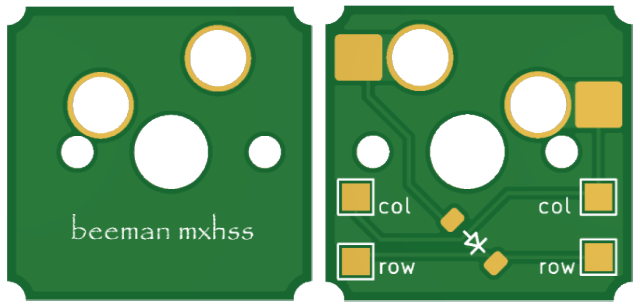

# mxhs
simple hotswap single switch pcb for handwired keyboards

## picture

## BOM
- mx hotswap sockets
- SOD 123 1n4148 diodes

## Prototype PCBS sponsored by [PCBway](https://www.pcbway.com/)!

upload the grbr from the releases tab & select "panel by pcbway" & then enter 4*5.
this will give you 100 pcbs :)